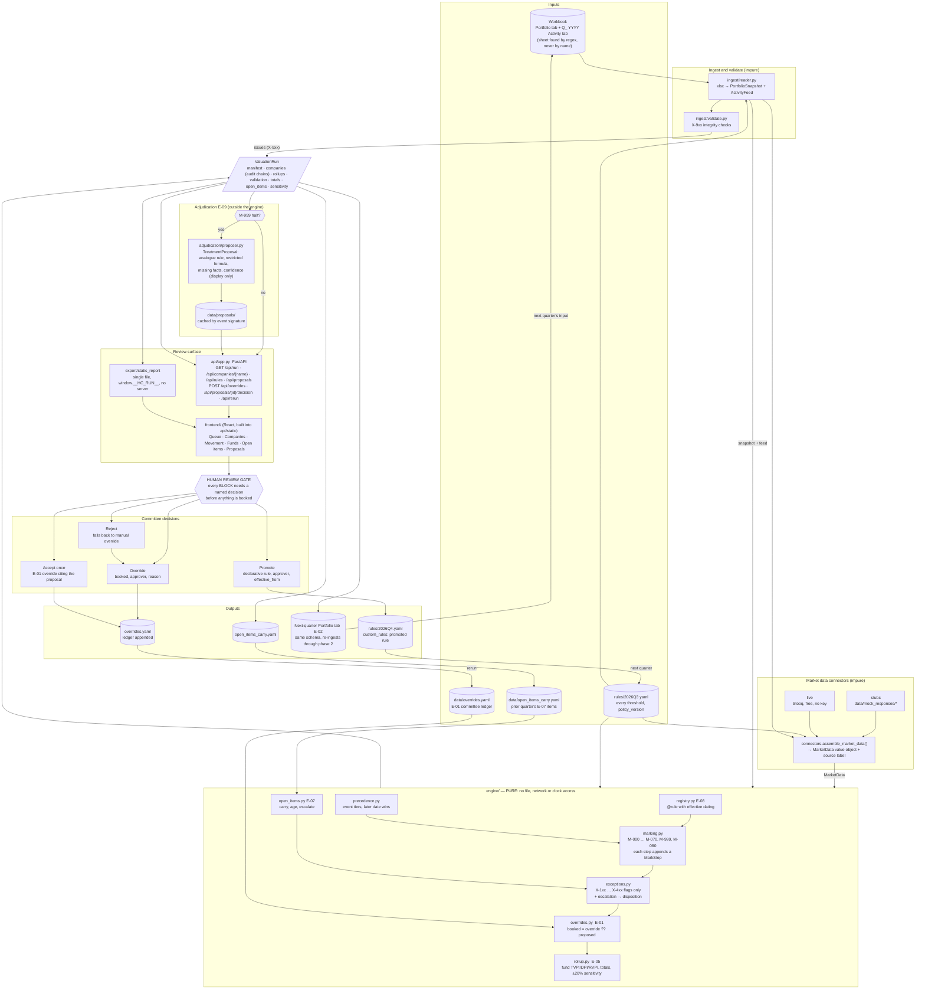

# Val_engine — Architecture

How the quarterly valuation run is built, where the human gate sits, and what is real versus stubbed in this repository. The marking policy itself is in `valuation-policy.md`; the build sequence and constraints that produced this layout are in the build specification. This document describes the code as it exists.

---

## 1. The quarterly run, as a diagram



Read it left to right as a quarter: the workbook lands, it is read and checked, market data is assembled into a value object, the pure engine turns snapshot + feed + market + ledger + policy into a `ValuationRun`, anything the engine could not recognise goes to the adjudicator for a draft, the review surface shows the queue, the committee decides, and the decisions become inputs to the next run (the ledger) or the next quarter (a promoted rule, the emitted Portfolio tab, the carried open items). Nothing is booked on the path from engine to output without passing the gate.

Status of this checkout: every module in the diagram is present — `config.py`, `ingest/`, `engine/`, `pipeline.py`, `connectors/` (protocols, vendor-shaped stubs, one live Stooq feed with fall-back), `adjudication/` (schema, DSL check, proposer, promotion), `export/` (workbook, next-quarter snapshot, single-file static report), `api/app.py`, `cli.py`, the frontend and its built bundle in `api/static/`. Each work package landed behind its own tests (`tests/test_ingest.py`, `test_golden.py`, `test_determinism.py`, `test_rules.py`, `test_edge_cases.py`, `test_coverage.py`, `test_connectors.py`, `test_adjudication.py`, `test_export.py`, `test_api.py`, `test_cli.py`).

---

## 2. What triggers a run

| Trigger | Path | Notes |
|---|---|---|
| A new workbook landing | `pipeline.execute(RunPaths.default(workbook=...))` | The default path is `data/HC_Mock_Portfolio_Data.xlsx`; the activity sheet is located by the regex in `schema.activity_sheet_pattern` (`^Q[1-4] \d{4} Activity$`), so a Q4 tab loads with no code change. |
| CLI | `hc-valuation run \| build \| validate \| export \| rules \| version` | `run` serves the dashboard on the API; `build` writes the static report and the export set; `validate` runs ingest + X-9xx and exits non-zero on a blocking issue; `export` writes the review workbook and CSVs; `rules` lists the registry. The console script is declared in `pyproject.toml`. |
| API rerun | `POST /api/rerun` | Re-executes the pipeline against the current ledger and policy — this is how an override recorded through the UI becomes a new `booked_nav`. |

`pipeline.execute()` is the one impure orchestrator: load policy → read workbook → validate → assemble market data → load ledger and carried open items → `run_valuation(...)` → adjudicate M-999 halts if `adjudication.enabled`. It returns `PipelineResult(run, config, paths, market, proposals)`. The `generated_at` timestamp is passed *in* (the engine never reads the clock), and the run id is `sha256(input_sha256 | policy_version | engine_version)[:12]`, so the same workbook under the same policy always names the same run.

---

## 3. Where each live feed plugs in

The engine consumes one `MarketData` value object (`engine/models.py`): `quotes` (company → market cap at the measurement date), `comps` (sector → EV/ARR), `comp_history` (sector → month → multiple) and `as_of`. `connectors.assemble_market_data(cfg, root, snapshot, feed, provider=None)` builds it and returns a source label for the manifest. Everything the connector layer does happens before `run_valuation` is called; the engine cannot tell a stub from a vendor.

| Feed | Protocol supplies | Which rules read it | Status in this tree |
|---|---|---|---|
| PitchBook | Sector comp multiples now and by month (`comps`, `comp_history`) | X-401/402 in `relative_to_comps` mode; M-080 calibration; the sensitivity view's "multiple-exposed NAV" | Vendor-shaped fixture in `data/mock_responses/pitchbook/comps_software.json` |
| S&P Capital IQ | Public index multiples as a cross-check on sector comps; listed-company market caps (`quotes`) for M-040 | M-040 (9/30 close), X-401/402 | Fixture in `data/mock_responses/sp_capiq/index_multiples.json`; the IPO quote is currently seeded to the IPO print by the stub and says so in `MarketQuote.source` |
| Foresight | Company operating metrics as a time series (ARR, growth, burn, headcount, margin) | Would replace the workbook's single-point ARR/runway columns for X-3xx and enable the rules deliberately not written (margin trend, headcount change) | Fixture in `data/mock_responses/foresight/company_metrics.json`; not read by the engine — the workbook columns are the source today |
| AlphaSense | News and filing signals per company | Would feed X-105-style screens with external text; never a number | Fixture in `data/mock_responses/alphasense/news_signals.json`; not read by the engine |
| Stooq (live) | Free daily closes, no API key | M-040 price source when `provider=live` | `connectors/live.py`, with fall-back to the stub on network failure |

Provider selection is an explicit argument, else the `HC_MARKET_PROVIDER` environment variable, else `stub`; `live` tries Stooq and falls back to the stub on any failure, and the manifest label then says `stub` rather than pretending. Swapping stub → live changes no line in `engine/`.

---

## 4. The engine boundary, and why it is pure

```python
def run_valuation(portfolio, activity, market, overrides, config, *, validation=(), prior_open_items=(),
                  input_sha256="", input_file="", generated_at=None, market_data_source="none") -> ValuationRun
```

`engine/` imports nothing from `api/`, `ingest/`, `connectors/`, `adjudication/`, `export/` or `pipeline`. It does no file, network or clock access; the measurement date comes from `config.quarter`, and `generated_at` is an argument. Three things follow:

1. **Determinism is testable.** Two runs over the same inputs serialise byte-identically (`tests/test_determinism.py`), and the golden file (`tests/fixtures/golden_q3_2026.json`) pins 18 event treatments, four queue counts and the portfolio total without mocking anything.
2. **Connectors are replaceable.** Market data arrives as an already-fetched value object. A live PitchBook client replaces the stub in the pipeline and the engine does not notice.
3. **Adjudication cannot leak into a number.** E-09 runs after the run, outside the engine, on the run's output. A proposal is data beside a blocked position; the only way it changes a mark is by a person recording an override (E-01) or promoting a rule (E-08), both of which are inputs to the *next* run.

If a later change makes `run_valuation` need I/O, the change is wrong.

---

## 5. The audit chain

Every company carries `steps: tuple[MarkStep, ...]`, and `CompanyResult` asserts at construction that `proposed_mark == steps[-1].new_value`. A `MarkStep` records the rule id and version, sequence number, every input the rule read, the prior and new value, a one-sentence rationale, and an `EventRef` (sheet, row index, event type, date) when an activity row was the evidence. Carry-forward writes a step. A skipped or superseded event writes a step saying why. An E-01 override writes a step that records the decision without altering `proposed_mark` (the step's prior and new value are both the proposal; `booked_mark` carries the override). M-080, when enabled, writes a step and an entry in `alternative_marks` and never touches the base mark.

The review table is that chain rendered. In the dashboard a blocked company expands to its full chain in two clicks: one on the BLOCK tile or the Queue card, one to open the chain; the Companies table does the same from any row.

---

## 6. Three layers of rules

**Layer 1 — mechanical marking rules (`engine/marking.py`, registered in `engine/registry.py`).** Deterministic; each produces a number and appends a step. Registered with `@rule(rule_id, version, applies_to, severity, effective_from, tier, terminal)`. The registry picks the most specific in-force handler for an event type as of the measurement date; declarative rules (promoted from E-09) win over builtins for the same event type; `("*",)` is the fallback, which is M-999.

**Layer 2 — exception rules (`engine/exceptions.py`, plus treatment flags raised inside marking).** They return `Flag(rule_id, family, severity, message, evidence)` and nothing else. The families are `treatment`, `staleness`, `growth`, `liquidity`, `valuation`. The severity test for each: could a reviewer change the booked number? If not, MONITOR.

**Layer 3 — the policy file (`rules/2026Q3.yaml` → `config.py` `RuleConfig`).** Every threshold, the quarter window, the reporting lag, the escalation rule, the note-screen terms, the open-item ageing limits, the adjudication whitelist, and `custom_rules` (declarative rules promoted from E-09). Strict: an unknown key raises. `inherits` lets `2026Q4.yaml` override only what changed, so the diff between quarters is the policy audit trail. There is no threshold literal in engine code.

---

## 7. Escalation logic

`exceptions.disposition(flags, terminal, cfg)`:

1. Terminal event this quarter (closed exit, shutdown) → **CLEAR**, and carry-side flags are dropped: a wound-down company does not need a runway flag.
2. Any BLOCK flag → **BLOCK**.
3. REVIEW flags from at least `escalation.review_rules_to_block` (2) *distinct families* → **BLOCK**. Two REVIEW flags from the same family do not compound.
4. Otherwise one or more REVIEW → **REVIEW**; MONITOR only → **MONITOR**; nothing → **CLEAR**.

The compound rule is what separates "stale round" (REVIEW on its own) from "stale round *and* ARR contracting 20%" (Birchhollow: two families, BLOCK). Flags themselves never change a number; a BLOCK means the run is not bookable until a decision is recorded against that company.

Flag ids as implemented: X-101 non-mechanical treatment (BLOCK for IPO, announced acquisition, closed exit with no proceeds; REVIEW when exit proceeds differ from ownership × deal value), X-102 down round (BLOCK), X-103 non-participation dilution (MONITOR), X-104 secondary price spread (REVIEW), X-105 note-language screen (REVIEW), X-106 flat extension without price discovery (REVIEW), X-107 funded bridge note (REVIEW), X-108 unfunded bridge note (MONITOR), X-109 term sheet disclosure (MONITOR), X-201/202 staleness (MONITOR > 24 mo / REVIEW > 48 mo), X-301/302 ARR contraction (MONITOR < 0 / REVIEW < −15%), X-303/304 runway aged one month (MONITOR < 12 / REVIEW < 6), X-401/402 implied multiple high/low (MONITOR, both directions), X-403 ARR below the screening floor (MONITOR), X-404 MOIC > 5× on a stale round (MONITOR), E-01 override drift (REVIEW), E-07 open item past its ageing limit (REVIEW), M-999 unrecognised event (BLOCK). X-9xx are ingestion issues raised before the engine runs and carried in `ValuationRun.validation`.

---

## 8. Engine components E-01 … E-09

**E-01 Override ledger** (`engine/overrides.py`, `data/overrides.yaml`). `booked = override.booked ?? proposed`. A record carries company, quarter, proposed, booked, reason, approver, created_at, the rule ids it addresses and, if it came from accept-once, the source proposal. The proposal is never mutated; if the engine's proposal has moved since the override was recorded (inputs or policy changed) the booked figure stands and an E-01 REVIEW flag makes the drift visible. Without this component the committee's decision evaporates and the same flag re-litigates next quarter.

**E-02 Next-quarter snapshot** (`export/snapshot.py`). Emits a Portfolio tab in the identical input schema with this quarter's booked marks, ownership and status as the opening position, so this quarter's output is next quarter's input. The phase-09 gate is that the emitted tab re-ingests through phase 2 with zero validation errors.

**E-03 Run manifest and determinism** (`RunManifest` in `engine/models.py`, built in `engine/run.py`). run_id, sha256 of the input file, input file name, policy version, engine version, quarter label, measurement date, prior close, generated_at, whether adjudication was enabled, and the market data source label. Same input → byte-identical output; the dashboard footer shows the manifest so a screenshot of the queue is traceable to a file hash and a policy version.

**E-04 Fair value hierarchy** (assigned by the marking rules, carried as `fv_level`). Active positions open at Level 3; M-040 moves a position to Level 1 and marks it `listed`; terminal events set the level to none. Q3 2026: Drayvenn L1, every other active position L3. Level 1 positions are exempt from the staleness and MOIC screens because they have a daily price.

**E-05 Fund roll-up** (`engine/rollup.py`). Per fund: companies, active, invested, prior/proposed/booked NAV, realized in quarter and cumulative, TVPI, DPI, RVPI, and the top positions by share of booked NAV. Portfolio totals add net movement, written off, disposition counts, Level 1 count and top-10 concentration. The same module computes the ±20% multiple sensitivity: the shock is applied to Level 3 positions with ARR above the screening floor; Level 1, pre-revenue and terminal positions are held flat.

**E-06 Golden file** (`tests/test_golden.py`, `tests/fixtures/golden_q3_2026.json`). Pins the 18 event treatments to the cent, the four queue counts and the portfolio total. A threshold change fails it with a readable diff. Regenerated deliberately, never hand-edited.

**E-07 Open items register** (`engine/open_items.py`). Marking rules open items — a convertible note, a pending acquisition, a term sheet, an IPO lock-up with its expiry date — and the run carries them out. On the next run, items from `open_items_carry.yaml` that the quarter's events did not resolve age by one quarter; past the policy limit (`announced_deal_stale_quarters: 2`, `term_sheet_stale_quarters: 1`, `note_unconverted_quarters: 3`) they escalate with an E-07 REVIEW flag on their own, because a deal still pending after two quarters is a different fact from a fresh one. Lock-ups expire quietly on their date. Q3 opens five: Duskfern and Emberfold notes, Gryphonel pending close, Halcyra term sheet, Drayvenn lock-up to 2027-03-19.

**E-08 Rule registry with effective dating** (`engine/registry.py`, `engine/declarative.py`). Adding a rule is adding a function with `@rule(...)` or a `custom_rules` entry in the policy file; the orchestrator is never edited. `effective_from` guarantees a rule written for Q4 does not rewrite Q3 when Q3 is re-run. Declarative rules are evaluated by `engine/dsl.py`, a restricted expression language over the whitelisted fields (`ownership_before`, `ownership_after`, `post_money`, `deal_value`, `proceeds`, `prior_mark`, `hc_investment`, `close_probability`, `note_at_cost`) with `* / + -`, `min`, `max`, numeric literals and parentheses. The parser walks a Python AST by hand and rejects anything else before evaluation; no model output is ever executed.

**E-09 Novel-case adjudication** (`adjudication/`, `data/proposals/`). When M-999 halts on an event type with no handler, the adjudicator drafts a `TreatmentProposal` beside the blocked position: the existing rule it reasons by analogy from, a formula in the DSL, a parameter map, a suggested severity never below REVIEW, the facts the schema does not contain, a confidence that is displayed and gates nothing, and provenance. Proposals are cached by event signature so re-runs reproduce rather than re-query, which keeps the golden test intact with adjudication on or off. Three outcomes, each requiring a named approver: **reject** (the position stays blocked; manual override), **accept once** (an E-01 override with the draft as the documented reason; no rule is created), **promote** (a `custom_rules` entry in the next quarter's policy with approver and `effective_from`). After the same treatment is accepted three times the queue suggests promotion. The system must run correctly with adjudication disabled: M-999 blocks exactly as before, and no proposal is produced. A proposal's id is `sha(event_signature | catalogue_version)` and the catalogue version embeds the policy version, so a policy bump invalidates cached drafts.

---

## 9. Key assumptions in the Q3 2026 numbers

- **Last-round pricing** is the base identity: `mark = FD ownership × post-money`. An arm's-length priced round in the subject security is treated as the strongest Level 3 input available and resets the staleness clock; a flat same-terms extension (M-011) reprices mechanically but does not reset the clock.
- **Drayvenn is seeded to the IPO print.** The policy says the 9/30 close, but the ticker is synthetic and no feed can price it, so the stub seeds the measurement-date market cap to the IPO print and labels the quote `stub:seeded_to_ipo_print`. The X-101 flag asks the committee to confirm the price source. Proposed NAV of $1,183.9M assumes this.
- **Gryphonel at 0.90.** The announced acquisition is probability-weighted at `announced.close_probability: 0.90`; `at_full_deal_value` and `hold_prior` are recorded as alternative marks for the committee.
- **Lock-up discount 0%.** ASC 820 disfavors blockage factors for Level 1; `ipo.lockup_discount_pct: 0.00`. The lock-up itself is an open item to 2027-03-19.
- **Secondary remainder at last round.** `secondary.remainder_basis: last_round`; the print 5.5% below is recorded as `at_secondary_price` and X-104 flags the spread.
- **Reporting-lag ageing.** Operating metrics are as of late August; runway is aged by `metrics.reporting_lag_months: 1` before the X-303/304 thresholds apply.
- **Absolute multiple thresholds.** `multiple.mode: absolute` (30× high, 3× low, $0.5M ARR floor) because the comps feed is a fixture; `relative_to_comps` is wired and switches on in config.

Dispositions on this basis: 7 BLOCK / 15 REVIEW / 44 MONITOR / 34 CLEAR (Drayvenn, Gryphonel, Oakenvale, Tarnwick Aerospace, Duskfern, Birchhollow, Pellagrin). The policy document's earlier count of 6 predates X-106, which puts Pellagrin's flat extension and its 59-month staleness in two REVIEW families.

---

## 10. What was stubbed, and why

| Stubbed | Why |
|---|---|
| Market caps and comps (all four vendor feeds) | No credentials in an evaluation exercise; the fixtures are vendor-shaped so a real client is a drop-in behind the same protocol. |
| The IPO price at 9/30 | Synthetic ticker; seeded to the print and labelled as such rather than inventing a close. |
| M-080 comps calibration | Off by default (`calibration.enabled: false`); it needs a comp history by month per sector that only a live feed can supply honestly. When on it writes `calibrated_to_comps` as an alternative only. |
| The adjudicator's model | `adjudication.provider: stub` produces heuristic drafts from the rule catalogue so the E-09 path is exercised end to end without a model or a key; `claude` is the configured alternative. |
| Foresight metrics and AlphaSense signals | Fixtures exist; the engine reads ARR, growth, cash and burn from the workbook because that is the only source with a defined as-of date this quarter. |

---

## 11. What we would build next with real data access

1. **A real 9/30 close for Drayvenn** through the S&P or Stooq quote path, removing the seeded print and the price-source line from the X-101 flag.
2. **Comps-calibrated marks with M-080 on.** With a PitchBook history by sector and month, flip `calibration.enabled` and `multiple.mode: relative_to_comps`; the 40 stale-round candidates get a labelled alternative column, and X-401/402 use sector multiples instead of absolute bounds.
3. **Foresight metrics time series**, which makes the rules deliberately not written possible: margin trend and headcount change need a prior period, and runway recomputed from a burn series rather than a single point.
4. **Waterfall and preference modelling for recaps.** M-012 treats a down round's headline as an upper bound and blocks; with the preference stack and pay-to-play terms in structured form the engine could compute the common-equivalent value instead of asking the committee for it.
5. Beyond those: escrow and holdback as receivables on closed exits (the schema supports it; no Q3 event needed it), and a continuation-vehicle or structured-secondary rule once a real case defines it — added as a policy version bump, not a quiet mid-quarter change.

---

## 12. AI tooling note

The rule set and this codebase were drafted with Claude, working from the workbook and the marking policy. The thresholds were not taken on faith: they were tuned by running the exception screens across all 100 companies and reading the resulting queue. A first cut flagged 58 of 96 active positions, which is a queue nobody would read; it was reworked with compound escalation (two REVIEW families to block) and the "could a reviewer change the number?" test, which moved non-participation dilution, unfunded notes and term sheets down to MONITOR and produced the queue in section 9.

The build was agent-assisted with a gate per phase: each phase had a numeric or behavioural gate verified against the workbook (100 positions and 18 events; $1,183.9M proposed NAV; the blocked names; five open items; two runs serialising identically) before the next phase started, and the golden file exists so that later phases could not quietly change earlier numbers. The dashboard palette was validated with a colour-vision checker rather than by eye, and every view was screenshotted in light and dark and inspected before this document was written. No model output is a booked number anywhere in the system; the adjudicator proposes rules, the deterministic engine computes values, and a named person decides.
