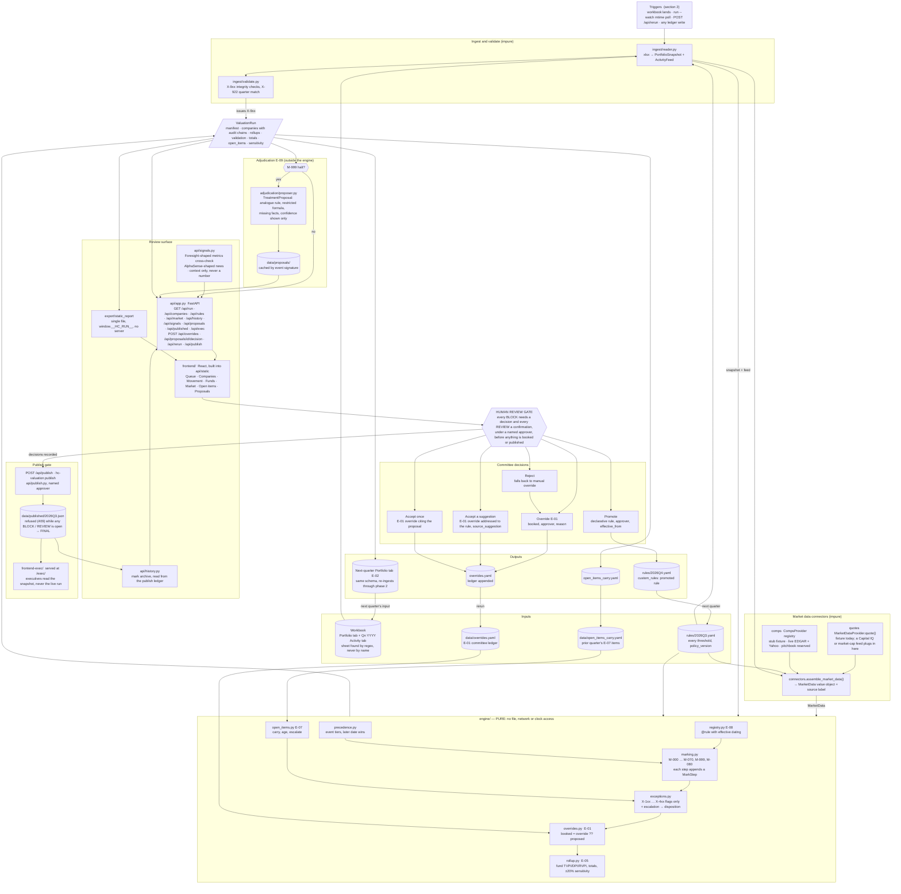

# Val_engine — Architecture

How the quarterly valuation run is built, where the human gate sits, and what is real versus stubbed in this repository. The marking policy itself is in `valuation-policy.md`; the build sequence and constraints that produced this layout are in the build specification. This document describes the code as it exists.

## 0. Reader's guide — the brief's questions, in plain words

*For a partner who will not read past this section.* The rest of the document is written for whoever has to run or extend the system and carries rule ids in most sentences; everything below is the same content without them.

**What the engine does.** Every quarter a workbook lands with two tabs: the book at the last close and the quarter's activity. The engine reads both, rolls every position forward under the firm's base rule (a priced round resets the mark to ownership × the new post-money, an exit moves to realized or to zero, no activity carries the prior mark), proposes a mark for all 100 positions, and sorts them into four piles: seven that need a committee decision, twenty that need a reviewer's confirmation, thirty-nine to watch, thirty-four that are clear. For Q3 2026 that is $1,139.3M rolling to $1,184.3M proposed; the seven decisions are listed at the top of the README.

**Where the live feeds plug in.** The engine never calls the outside world; a data layer fetches first and hands it a finished value object. Each vendor has a slot with a documented shape — PitchBook for sector multiples, S&P for a listed company's price, Foresight for operating metrics, AlphaSense for news — and each slot is a registry: a real client is one registered factory, and nothing downstream changes. The slots are filled with vendor-shaped stubs, except one: **SEC EDGAR filings and Yahoo Finance closes are wired live** to build sector EV/revenue multiples from public comparables, cached so a re-run is deterministic and works offline. That live history is what the stale-round calibration and the observed sensitivity run on (sections 3 and 9).

**What triggers a run.** A workbook dropped in place (the server watches it), a committee decision recorded in the tool, or an explicit re-run. A scheduled trigger for a production close is described but not built (section 2).

**Where human review sits.** Between the proposal and the book, and it is a gate rather than a suggestion: every BLOCK position needs a decision and every REVIEW position a confirmation, each recorded under a named approver in a ledger the next run reads; the executive dashboard shows only a published snapshot, and publishing is refused — in the tool and at the API — while anything is undecided (section 7). A model may recommend which of the engine's priced options to take, and may draft a rule for an event type nobody has seen; it never prices a number.

**Key assumptions.** Post-money × ownership is fair value for a private position unless something on the row says otherwise; an announced deal is worth its price weighted by the chance it closes; a bridge note HC funded is carried at cost on its own leg; a same-terms extension is not price discovery; a down round is a ceiling until the preference stack is read. Each is a written departure from the literal base rule and each is gated (policy document, section 2).

**What is stubbed, and what comes next.** Vendor feeds other than EDGAR + Yahoo; the measurement-date quote for the one listed position (seeded to its IPO print and flagged); authentication, a database-backed ledger, a scheduler and secrets management (section 11). Already in: relative-to-comps screening on the live multiples (X-201 keys off the live sector median when the cache is populated), the structure-adjusted option on down rounds, and the second approver on publish (`publish.require_second_approver`). With real data access next: the remaining vendor connectors (quotes, company metrics, news signals — each a registered factory behind a Protocol) and a preference-stack-aware waterfall for down rounds in place of the flat structure haircut.

**Where AI helped.** Building the engine (agent-assisted with a numeric gate per phase); the one-recommendation-per-flag chooser and the novel-event adjudicator at run time, both fenced so that a model chooses or drafts but never computes a mark (section 12).

---

## 1. The quarterly run, as a diagram



Read it top to bottom as a quarter: a trigger fires (section 2), the workbook is read and checked, market data is assembled into a value object, the pure engine turns snapshot + feed + market + ledger + policy into a `ValuationRun`, anything the engine could not recognise goes to the adjudicator for a draft, and the review surface shows the queue. The human path is: **the engine proposes → the review queue → a decision under a named approver → publish → executives.** Decisions become inputs to the next run (the ledger) or the next quarter (a promoted rule, the emitted Portfolio tab, the carried open items). Publishing freezes the run into `data/published/<quarter>.json`. It is gated on decisions: `publish.outstanding()` lists every position still BLOCK or REVIEW with the flags waiting on it, the review tool's Publish button opens a locked popup showing that list (with a link to each row) instead of the publish form, and `POST /api/publish` refuses with 409 and the same list — so the book reaches executives only as FINAL, after a named person has decided or confirmed every one. The executive dashboard at `/exec/` reads only that snapshot, and the mark-history archive (`api/history.py`) is assembled from the same ledger. Nothing is booked, and nothing reaches an executive, without passing the gate.

Status of this checkout: every module in the diagram is present — `config.py`, `ingest/`, `engine/`, `pipeline.py`, `connectors/` (protocols, vendor-shaped stubs, the provider registry, one live EDGAR + Yahoo/Stooq feed with fall-back), `adjudication/` (schema, DSL check, proposer, promotion), `export/` (workbook, next-quarter snapshot, single-file static report), `api/` (`app.py`, `publish.py`, `history.py`, `signals.py`, `exec_view.py`), `cli.py`, the two frontends and their built bundles in `api/static/` and `api/static_exec/`. Each work package landed behind its own tests: `tests/test_ingest.py`, `test_normalize.py`, `test_golden.py`, `test_determinism.py`, `test_rules.py`, `test_rules_extended.py`, `test_edge_cases.py`, `test_coverage.py`, `test_connectors.py`, `test_market_feed.py`, `test_adjudication.py`, `test_export.py`, `test_api.py`, `test_cli.py`, `test_publish.py`, `test_history.py`, `test_flag_points.py`, `test_suggestions.py`, `test_gauntlet.py`.

---

## 2. What triggers a run

Three things start a run today; a fourth is what production would add.

| Trigger | Path | Notes |
|---|---|---|
| (a) A workbook landing | `pipeline.execute(RunPaths.default(workbook=...))`, run by `hc-valuation run` or `build` (`--input` to point elsewhere) | The default path is `data/HC_Mock_Portfolio_Data.xlsx`; the activity sheet is located by the regex in `schema.activity_sheet_pattern` (`^Q[1-4] \d{4} Activity$`), so a Q4 tab loads with no code change. The tab's quarter must match the policy's quarter or the run blocks (X-922, `ingest/validate.py`): a Q4 book run under the Q3 policy would push Q4 events through Q3's window and measurement date, which is a wrong run, not a data error. `hc-valuation next-policy` writes the matching policy file. |
| (b) A watched input changing | `hc-valuation run --watch` | The server thread (`api/app.py::watch_inputs`) polls the mtimes of the workbook, the policy folder (`rules/*.yaml`, because of `inherits`), `data/overrides.yaml`, `data/precedent.yaml`, `data/open_items_carry.yaml` and `data/proposals/*.json` every two seconds and recomputes on a change; the market cache is deliberately not watched (a refetch is an explicit `--refresh-market`). The open dashboard polls `GET /api/health` and reloads itself when the run stamp (`run_id@generated_at`) moves. This is the "self-refreshing output" in its current form: drop a new workbook in place and the page you have open shows the new run. |
| (c) A decision or rerun through the API | `POST /api/rerun`; every ledger write (`POST /api/overrides`, `POST /api/proposals/{id}/decision`, `POST /api/publish`) | Re-executes the pipeline against the current ledger and policy — this is how an override recorded through the UI becomes a new `booked_nav`. |
| (d) Production: a schedule or an inbox | A T+N business-day job after quarter end, or a watched inbox / SharePoint folder, invoking the same `execute()` | **Not built.** Listed under production hardening in section 11. There is nothing engine-side to add: (a)–(c) already call the one entry point a scheduler would. |

The CLI is `hc-valuation run | build | validate | export | rules | publish | market | history | next-policy | version` (the console script is declared in `pyproject.toml`; `python3 -m hc_valuation ...` is the same thing for a machine where the script did not land on PATH). `run` serves both dashboards on the API; `build` writes the static report and the export set; `validate` runs ingest + X-9xx and exits non-zero on a blocking issue; `export` writes the review workbook and CSVs; `rules` lists the registry; `publish` freezes the run for executives under a named approver; `market` prints the comps feed report; `history` prints the mark archive (`api/history.py` assembles each company's quarter-over-quarter booked marks from the publish ledger `data/published/`, the optional backfill `data/mark_history.yaml` and the current run, tagging every point with its source and noting disagreements; the review tool's detail panel charts it); `next-policy` writes the next quarter's rules file.

`pipeline.execute()` is the one impure orchestrator: load policy → read workbook → validate → assemble market data → load ledger and carried open items → `run_valuation(...)` → adjudicate M-999 halts if `adjudication.enabled`. It returns `PipelineResult(run, config, paths, market, proposals, market_report)`. The `generated_at` timestamp is passed *in* (the engine never reads the clock), and the run id is `sha256(input_sha256 | policy_version | engine_version)[:12]`, so the same workbook under the same policy always names the same run.

---

## 3. Where each live feed plugs in

The engine consumes one `MarketData` value object (`engine/models.py`): `quotes` (company → market cap at the measurement date), `comps` (sector → EV/ARR), `comp_history` (sector → month → multiple) and `as_of`. `connectors.assemble_market_data(cfg, root, snapshot, feed, provider=None)` builds it and returns a source label for the manifest. Everything the connector layer does happens before `run_valuation` is called; the engine cannot tell a stub from a vendor.

| Feed | Protocol supplies | Which rules read it | Status in this tree |
|---|---|---|---|
| PitchBook | Sector comp multiples now and by month (`comps`, `comp_history`) through `CompsProvider` | X-401/402 in `relative_to_comps` mode; M-080 calibration | Vendor-shaped fixture in `data/mock_responses/pitchbook/comps_software.json`, parsed by `StubCompsProvider`. Providers live in a registry (`connectors/__init__.py::register_comps_provider`, factories keyed by name — `stub`, `live`, `pitchbook`); there is no `elif` chain, so a third vendor is one registered factory. `pitchbook` is registered and reports "not configured" until `PITCHBOOK_API_KEY` and a client exist. |
| S&P Capital IQ (or any market-cap source) | The measurement-date quote for a listed position (`quotes`) through `MarketDataProvider.quote()` | M-040 (the 9/30 close, Level 1), M-041 listed carry | The slot is a registry like the comps one (`connectors/__init__.py::register_quotes_provider`, chosen by argument, `HC_QUOTES_PROVIDER`, else `stub`); today only the fixture is registered, which seeds a newly listed name to its IPO print and says so in `MarketQuote.source` (`stub:seeded_to_ipo_print`). A real provider implements `quote()` and is registered under its name; nothing downstream changes. The Foresight metrics and AlphaSense signal slots follow the same pattern (`register_metrics_provider`, `register_signals_provider`). |
| Foresight | Company operating metrics as a time series (ARR, growth, burn, headcount, margin) through `CompanyMetricsProvider` | **No rule.** `api/signals.py` → `GET /api/signals` → the review tool's "Vendor signals" card, which lines the vendor's numbers up beside the workbook's and highlights a gap above 10% (`MATERIAL_DRIFT`) so a restatement is seen, not booked | Fixture in `data/mock_responses/foresight/company_metrics.json`; consumed for display only. The engine reads ARR, growth, cash and burn from the workbook, the one source with a defined as-of date. A real feed would also let the rules deliberately not written (margin trend, headcount change) be written. |
| AlphaSense | Dated news and filing signals per company with a sentiment, through `NewsSignalProvider` | **No rule.** Same card: the quarter's signals listed beside the position, dated, with sentiment | Fixture in `data/mock_responses/alphasense/news_signals.json`; consumed for display only. Neither vendor slot ever touches a mark, a flag or a disposition. |
| EDGAR + Yahoo (live, free; Stooq as the alternative price source) | Sector EV/TTM-revenue multiples now and by month (`comps`, `comp_history`) computed from SEC XBRL fundamentals (revenue, shares, net cash) and daily closes from a pluggable price source — Yahoo Finance's chart API by default, Stooq selectable with `--price-source` / `HC_PRICE_SOURCE` but currently behind a browser-verification wall — for the public baskets in `rules/comps_baskets.yaml` | The same slots as PitchBook: X-401/402 in `relative_to_comps` mode, M-080 calibration | `connectors/edgar.py`, `prices.py`, `stooq.py`, `fetch.py`, `cache.py`, `live.py` (`PublicCompsProvider`); cached under `data/market_cache/<as_of>/` (`prices/` keyed by `meta.price_source`); per-constituent fall-back to the fixture below `min_constituents`; a browser-verification page from a source is reported, never bypassed; the report behind `GET /api/market` and `hc-valuation market` — see `docs/market-feed.md` |

Provider selection is an explicit argument (`--provider`), else the `HC_MARKET_PROVIDER` environment variable, else `stub`. `live` (alias `stooq`) reads `data/market_cache/<measurement date>/` and makes no network call when the cache is complete (the manifest label is `live:edgar+<price source>`, e.g. `live:edgar+yahoo`); otherwise it fetches what is missing (`--refresh-market` refetches everything). Every failure is caught per constituent and listed in the report; a sector with fewer than `min_constituents` priced names keeps the fixture value, and if no sector reaches live the manifest label says `stub` rather than pretending — a live label never sits over fixture numbers. `assemble_market_data` returns the `MarketData`, the manifest label and the market report together (`MarketAssembly`); swapping stub → live changes no line in `engine/`.

---

## 4. The engine boundary, and why it is pure

```python
def run_valuation(portfolio, activity, market, overrides, config, *, validation=(), prior_open_items=(),
                  input_sha256="", input_file="", generated_at=None, market_data_source="none") -> ValuationRun
```

`engine/` imports nothing from `api/`, `ingest/`, `connectors/`, `adjudication/`, `export/` or `pipeline`. It does no file, network or clock access; the measurement date comes from `config.quarter`, and `generated_at` is an argument. Three things follow:

1. **Determinism is testable.** Two runs over the same inputs serialise byte-identically (`tests/test_determinism.py`), and the golden file (`tests/fixtures/golden_q3_2026.json`) pins 18 event treatments, four queue counts and the portfolio total without mocking anything.
2. **Connectors are replaceable.** Market data arrives as an already-fetched value object. A live PitchBook client replaces the stub in the pipeline and the engine does not notice.
3. **Adjudication cannot leak into a number.** E-09 runs after the run, outside the engine, on the run's output. A proposal is data beside a blocked position; the only way it changes a mark is by a person recording an override (E-01) or promoting a rule (E-08), both of which are inputs to the *next* run.

If a later change makes `run_valuation` need I/O, the change is wrong.

---

## 5. The audit chain

Every company carries `steps: tuple[MarkStep, ...]`, and `CompanyResult` asserts at construction that `proposed_mark == steps[-1].new_value`. A `MarkStep` records the rule id and version, sequence number, every input the rule read, the prior and new value, a one-sentence rationale, and an `EventRef` (sheet, row index, event type, date) when an activity row was the evidence. Carry-forward writes a step. A skipped or superseded event writes a step saying why. An E-01 override writes a step that records the decision without altering `proposed_mark` (the step's prior and new value are both the proposal; `booked_mark` carries the override). M-080, when it runs (calibration is on and the sector's comps are an observed history), writes a step and an entry in `alternative_marks` and never touches the base mark.

The review table is that chain rendered. In the dashboard a blocked company expands to its full chain in two clicks: one on the BLOCK tile or the Queue card, one to open the chain; the Companies table does the same from any row.

The exports carry the same chain so it can be followed off-line, back to the cell. The Audit Trail sheet and `audit_trail.csv` (`export/tables.py`) carry `Portfolio Row` (the position's own row in the Portfolio tab) and `Input Cells`, which cites where each input the rule read came from — `post_money='Q3 2026 Activity'!E14; prior_post_money=Portfolio!H21` — so Marks → Audit Trail → workbook cell is one lookup at each step. The Exceptions sheet carries `Action`, `Summary` (the flag's points), `Suggestions` and `Message`; `alternatives.csv` lists every alternative mark (`at_full_deal_value`, `hold_prior`, `at_secondary_price`, `calibrated_to_comps`, …) beside the proposal; the Summary sheet's sensitivity rows are labelled in words ("NAV exposed to the multiple shock (Level 3, ARR ≥ floor)") rather than by field name.

---

## 6. Three layers of rules

**Layer 1 — mechanical marking rules (`engine/marking.py`, registered in `engine/registry.py`).** Deterministic; each produces a number and appends a step. Registered with `@rule(rule_id, version, applies_to, severity, effective_from, tier, terminal)`. The registry picks the most specific in-force handler for an event type as of the measurement date; declarative rules (promoted from E-09) win over builtins for the same event type; `("*",)` is the fallback, which is M-999.

**Layer 2 — exception rules (`engine/exceptions.py`, plus treatment flags raised inside marking).** They return `Flag(rule_id, family, severity, message, evidence)` and nothing else. The families are `treatment`, `staleness`, `growth`, `liquidity`, `valuation`. The severity test for each: could a reviewer change the booked number? If not, MONITOR.

**Layer 3 — the policy file (`rules/2026Q3.yaml` → `config.py` `RuleConfig`).** Every threshold, the quarter window, the reporting lag, the escalation rule, the note-screen terms, the open-item ageing limits, the adjudication whitelist, and `custom_rules` (declarative rules promoted from E-09). Strict: an unknown key raises. `inherits` lets `2026Q4.yaml` override only what changed, so the diff between quarters is the policy audit trail. There is no threshold literal in engine code.

---

## 7. Escalation logic

`exceptions.disposition(flags, terminal, cfg)`:

1. Terminal event this quarter (closed exit, shutdown) → **CLEAR**, and carry-side flags are dropped: a wound-down company does not need a runway flag.
2. Any BLOCK flag → **BLOCK**.
3. REVIEW flags from at least `escalation.review_rules_to_block` (2) *distinct families* → **BLOCK**. Two REVIEW flags from the same family do not compound.
4. Otherwise one or more REVIEW → **REVIEW**; MONITOR only → **MONITOR**; nothing → **CLEAR**.

The compound rule is what separates "stale round" (REVIEW on its own) from "stale round *and* ARR contracting 20%" (Birchhollow: two families, BLOCK). Flags themselves never change a number; a BLOCK means the run is not bookable until a decision is recorded against that company. When a BLOCK arises from two REVIEW families rather than one BLOCK rule, the review tool says so with a chip beside the disposition — "escalated · 2 review items" (`escalatedReviewFamilies` in `frontend/src/components/ui.tsx`) — so the reader knows no single rule blocked and can see which two did.

**X-405, "mark no longer squares with performance"** is the one REVIEW that is built *from* MONITORs. It fires when the price behind the mark is older than `staleness.monitor_months` (24) **and** a live screen argues with it — X-401 (multiple above the ceiling), X-402 (below the floor), X-404 (outsized MOIC on an old round) or X-301 (revenue shrinking) — unless X-202 or X-302 has already put the position in REVIEW on its own, so nothing is double-counted. The reasoning is the severity test: an old price is not a wrong price, and a screen is not a valuation, so each half alone is MONITOR; together they are exactly the case where a reviewer could change the number. It is switched by `exceptions.performance_gap.enabled` and suggests affirm / calibrate to comps (M-080) / mark to cost. On the Q3 book it adds five REVIEWs — Arcfoundry, Pinwhistle, Yarrowbank, Foxtrellis, Mirthstone — which is how the queue moved from 7 / 15 / 44 / 34 to **7 BLOCK / 20 REVIEW / 39 MONITOR / 34 CLEAR**.

Every BLOCK and REVIEW flag carries `action` (the imperative), `points` (two or three scannable lines, `**bold**` on the words that carry the decision) and `message` (the full reasoning, shown in the review tool only on request). MONITOR carries neither an action nor points — it is context, not a gate — and `engine/state.py::Working.flag` enforces both halves of that; a rule promoted from YAML that writes no points falls back to its own first sentences. The exceptions export carries all three columns.

Every BLOCK and REVIEW flag also carries one to three `suggestions` — the resolutions the rule can put a number on (ratify as proposed, hold the prior mark, the full deal value, the secondary price, cost as a floor, an alternative mark), each a one-sentence label, two reasons and the booked mark it produces. Rules write them with a *basis* (`Suggest` in `state.py`) and `Working.resolved_flags` fills the numbers in only once the roll is finished and the proposal is final; two suggestions that book the same figure collapse to one, and one naming an alternative mark that never materialised is dropped. Accepting a suggestion in the review tool is an ordinary E-01 override addressed to that rule id (`source_suggestion` on the ledger record), confirmed under a named approver, so it re-runs into the booked mark, the disposition, the totals, the exports and the archive like any committee decision — and the proposal is never rewritten.

**One recommendation per flag.** The reviewer sees one resolution first — `Flag.recommendation` — chosen among those priced suggestions by `recommend.py`, which runs in the pipeline after the engine (like E-09; the engine never holds a client). Two choosers, set by `recommendation.provider` in the policy or `--recommender`: `policy` takes the rule's own default (its first suggestion, worded as the rule wrote it); `claude` sends the case brief — the position, the flag, the audit steps, any vendor signals, and the candidates with their booked numbers — to the Anthropic SDK and asks it to choose one candidate by key and explain the choice for this company. The reply is validated hard (the choice must be a candidate key; the wording must fit the card), the booked number is taken from the chosen candidate and never from the reply, and every answer is cached under `data/recommendations/<sha>.json` keyed by the brief, the prompt and the model, so a rerun is deterministic and offline. Without an API key or a cached answer it falls back to `policy` and the recommendation says so. `hc-valuation recommend` fills the cache; the manifest records `recommender` (`policy` or `claude:<model>`). The other candidates stay one click away ("Other engine-priced options"), and a recommendation is accepted exactly as any suggestion is — under a named approver, as an E-01 override.

Flag ids as implemented: X-101 non-mechanical treatment (BLOCK for IPO, announced acquisition, closed exit with no proceeds; REVIEW when exit proceeds differ from ownership × deal value), X-102 down round (BLOCK), X-103 non-participation dilution (MONITOR), X-104 secondary price spread (REVIEW), X-105 note-language screen (REVIEW), X-106 flat extension without price discovery (REVIEW), X-107 funded bridge note (REVIEW), X-108 unfunded bridge note (MONITOR), X-109 term sheet disclosure (MONITOR), X-201/202 staleness (MONITOR > 24 mo / REVIEW > 48 mo), X-301/302 ARR contraction (MONITOR < 0 / REVIEW < −15%), X-303/304 runway aged one month (MONITOR < 12 / REVIEW < 6), X-401/402 implied multiple high/low (MONITOR, both directions; absolute 30× / 3× bounds under this policy), X-403 ARR below the screening floor (MONITOR), X-404 MOIC > 5× on a stale round (MONITOR), X-405 stale price that a live screen argues with (REVIEW, above), E-01 override drift (REVIEW), E-07 open item past its ageing limit (REVIEW), M-999 unrecognised event (BLOCK). X-9xx are ingestion issues raised before the engine runs and carried in `ValuationRun.validation`.

---

## 8. Engine components E-01 … E-09

**E-01 Override ledger** (`engine/overrides.py`, `data/overrides.yaml`). `booked = override.booked ?? proposed`. A record carries company, quarter, proposed, booked, reason, approver, created_at, the rule ids it addresses and, if it came from accept-once, the source proposal. The proposal is never mutated; if the engine's proposal has moved since the override was recorded (inputs or policy changed) the booked figure stands and an E-01 REVIEW flag makes the drift visible. Without this component the committee's decision evaporates and the same flag re-litigates next quarter.

**E-02 Next-quarter snapshot** (`export/snapshot.py`). Emits a Portfolio tab in the identical input schema with this quarter's booked marks, ownership and status as the opening position, so this quarter's output is next quarter's input. The phase-09 gate is that the emitted tab re-ingests through phase 2 with zero validation errors.

**E-03 Run manifest and determinism** (`RunManifest` in `engine/models.py`, built in `engine/run.py`). run_id (a hash of the workbook's sha256, the policy version, the engine version and the decisions — the override ledger, the carried open items and staleness anchors — so a committee override after a publish gives the live run a new identity and the review tool's "changes since" indicator can say executives are looking at an older book), sha256 of the input file, input file name, policy version, engine version, quarter label, measurement date, prior close, generated_at, whether adjudication was enabled, and the market data source label. Same input → byte-identical output; the dashboard footer shows the manifest so a screenshot of the queue is traceable to a file hash and a policy version.

**E-04 Fair value hierarchy** (assigned by the marking rules, carried as `fv_level`). Active positions open at Level 3; M-040 moves a position to Level 1 and marks it `listed`; terminal events set the level to none. Q3 2026: Drayvenn L1, every other active position L3. Level 1 positions are exempt from the staleness and MOIC screens because they have a daily price.

**E-05 Fund roll-up** (`engine/rollup.py`). Per fund: companies, active, invested, prior/proposed/booked NAV, realized in quarter and cumulative, TVPI, DPI, RVPI, and the top positions by share of booked NAV. Portfolio totals add net movement, written off, disposition counts, Level 1 count and top-10 concentration. The same module computes the ±20% multiple sensitivity — on every multiple-exposed position and on the software sectors alone (`sensitivity.software_sectors`) — and `comps_move`, the observed counterpart (each sector's public-comps move this quarter applied to the marks it drives). All three, with M-080, share one exposure flag, `CompanyResult.multiple_exposed`: Level 3 with ARR at or above the screening floor; Level 1, pre-revenue and terminal positions are held flat. The review tool's Movement page carries a Sensitivity view with a −20%…+20% slider that interpolates the same arithmetic by sector, fund and position.

**E-06 Golden file** (`tests/test_golden.py`, `tests/fixtures/golden_q3_2026.json`). Pins the 18 event treatments to the cent, the four queue counts and the portfolio total. A threshold change fails it with a readable diff. Regenerated deliberately, never hand-edited.

**E-07 Open items register** (`engine/open_items.py`). Marking rules open items — a convertible note, a pending acquisition, a term sheet, an IPO lock-up with its expiry date — and the run carries them out. On the next run, items from `open_items_carry.yaml` that the quarter's events did not resolve age by one quarter; past the policy limit (`announced_deal_stale_quarters: 2`, `term_sheet_stale_quarters: 1`, `note_unconverted_quarters: 3`) they escalate with an E-07 REVIEW flag on their own, because a deal still pending after two quarters is a different fact from a fresh one. Lock-ups expire quietly on their date. Q3 opens five: Duskfern and Emberfold notes, Gryphonel pending close, Halcyra term sheet, Drayvenn lock-up to 2027-03-19.

**E-08 Rule registry with effective dating** (`engine/registry.py`, `engine/declarative.py`). Adding a rule is adding a function with `@rule(...)` or a `custom_rules` entry in the policy file; the orchestrator is never edited. `effective_from` guarantees a rule written for Q4 does not rewrite Q3 when Q3 is re-run. Declarative rules are evaluated by `engine/dsl.py`, a restricted expression language over the whitelisted fields (`ownership_before`, `ownership_after`, `post_money`, `deal_value`, `proceeds`, `prior_mark`, `hc_investment`, `close_probability`, `note_at_cost`) with `* / + -`, `min`, `max`, numeric literals and parentheses. The parser walks a Python AST by hand and rejects anything else before evaluation; no model output is ever executed.

**E-09 Novel-case adjudication** (`adjudication/`, `data/proposals/`). When M-999 halts on an event type with no handler, the adjudicator drafts a `TreatmentProposal` beside the blocked position: the existing rule it reasons by analogy from, a formula in the DSL, a parameter map, a suggested severity never below REVIEW, the facts the schema does not contain, a confidence that is displayed and gates nothing, and provenance. Proposals are cached by event signature so re-runs reproduce rather than re-query, which keeps the golden test intact with adjudication on or off. Three outcomes, each requiring a named approver: **reject** (the position stays blocked; manual override), **accept once** (an E-01 override with the draft as the documented reason; no rule is created), **promote** (a `custom_rules` entry in the next quarter's policy with approver and `effective_from`). After the same treatment is accepted three times the queue suggests promotion. The system must run correctly with adjudication disabled: M-999 blocks exactly as before, and no proposal is produced. A proposal's id is `sha(event_signature | catalogue_version)` and the catalogue version embeds the policy version, so a policy bump invalidates cached drafts.

---

## 9. Key assumptions in the Q3 2026 numbers

- **Last-round pricing** is the base identity: `mark = FD ownership × post-money`. An arm's-length priced round in the subject security is treated as the strongest Level 3 input available and resets the staleness clock; a flat same-terms extension (M-011) reprices mechanically but does not reset the clock.
- **Drayvenn is seeded to the IPO print.** The policy says the 9/30 close, but the ticker is synthetic and no feed can price it, so the stub seeds the measurement-date market cap to the IPO print and labels the quote `stub:seeded_to_ipo_print`. The X-101 flag asks the committee to confirm the price source. Proposed NAV of $1,184.3M assumes this.
- **Gryphonel at 0.90.** The announced acquisition is probability-weighted at `announced.close_probability: 0.90`; `at_full_deal_value` and `hold_prior` are recorded as alternative marks for the committee.
- **Lock-up discount 0%.** ASU 2022-03: a contractual sale restriction (the 180-day lock-up) is not a characteristic of the security and takes no discount; `ipo.lockup_discount_pct: 0.00`. The lock-up itself is an open item to 2027-03-19.
- **Secondary remainder at last round.** `secondary.remainder_basis: last_round`; the print is the row's stated implied valuation (proceeds ÷ stake sold is recorded as a cross-check), booked as `at_secondary_price` and flagged X-104 when it departs from the round by more than 5%.
- **Reporting-lag ageing.** Operating metrics are as of late August; runway is aged by `metrics.reporting_lag_months: 1` before the X-303/304 thresholds apply.
- **Absolute multiple thresholds.** `multiple.mode: absolute` (30× high, 3× low, $0.5M ARR floor) because the comps feed is a fixture; `relative_to_comps` is wired and switches on in config.
- **The stub comp history trends hard.** With the live-history gate waived on the PitchBook-shaped fixture, 33 of the 45 M-080 candidates pin at the +35% bound and two more at −35%, so on the fixture it is the bound, not the comps, that sets most calibrated alternatives. That is a property of the fixture, not the rule, and the reason `calibration.require_live_history` is on: the fixture never calibrates; the live feed does. See the M-080 section of the policy document.

Dispositions on this basis: **7 BLOCK / 20 REVIEW / 39 MONITOR / 34 CLEAR** (blocked: Drayvenn, Gryphonel, Oakenvale, Tarnwick Aerospace, Duskfern, Birchhollow, Pellagrin). The policy document's original hand count of 6 blocks predates X-106, which puts Pellagrin's flat extension and its 59-month staleness in two REVIEW families; the count of 15 REVIEW predates X-405 (section 7).

---

## 10. What was stubbed, and why

| Slot | Stubbed or live | Why |
|---|---|---|
| Quotes (`MarketDataProvider.quote()`) | **Fixture.** Seeds a newly listed name to its IPO print and labels the quote `stub:seeded_to_ipo_print`. | The ticker is synthetic; no feed can price it. Seeding to the print and saying so is more honest than inventing a 9/30 close. X-101 asks the committee to confirm the price source. |
| Comps (`CompsProvider`) | **Fixture by default; live on request.** `--provider live` (or `HC_MARKET_PROVIDER=live`) computes sector EV/TTM-revenue multiples from EDGAR + Yahoo for the public baskets, cached under `data/market_cache/`. | No vendor credentials in an evaluation exercise; the free feed proves the slot end to end and the fixture stays vendor-shaped so a real client is a drop-in. |
| Foresight-shaped metrics | **Fixture, consumed for display.** `GET /api/signals` → the "Vendor signals" card. | The workbook is the only source with a defined as-of date this quarter, so the engine reads ARR, growth, cash and burn from it; the vendor numbers sit beside them as a cross-check. |
| AlphaSense-shaped signals | **Fixture, consumed for display.** Same card: dated news with sentiment. | Text is context for a reviewer, never an input to a number. |
| PitchBook | **Reserved, not configured.** The `pitchbook` factory is registered and reports "not configured" until `PITCHBOOK_API_KEY` and a client exist. | Credentials. |
| M-080 comps calibration | **Built and on**, gated to an observed comps history (`calibration.require_live_history: true`): under `--provider live` every stale Level 3 position whose sector history covers its round month gets a `calibrated_to_comps` alternative; the fixture never calibrates. The Market page lists every calibrated position (round month, comps then → now, factor, bound hit), and the `comps_move` block beside the ±20% shock applies each sector's observed quarter move to the marks it drives. | On the fixture most candidates would pin at the bound (section 9), so a live history is the only honest input; the EDGAR extraction reads each filer's own reported periods across every revenue concept it has used, so January/April fiscal years and concept switches (NVIDIA, C3.ai, SoundHound) price correctly, and Yahoo history runs 10 years so the round months are covered. |
| Claude adjudication (E-09) | **Real SDK call behind `adjudication.provider: claude`** (`anthropic` extra, `ANTHROPIC_API_KEY`); **default `stub`**, which produces heuristic drafts from the rule catalogue. Falls back to the stub draft, and says so, if the key or the package is missing. | The E-09 path is exercised end to end without a model or a key. No Q3 event triggers it: every Q3 event type has a handler, so no proposal exists on the real book; the fixture pack and tests exercise it. |

---

## 11. What we would build next with real data access

1. **A real 9/30 close for Drayvenn** through the quote slot (`quotes_provider_for` returning a Capital IQ or market-cap provider that implements `quote()`), removing the seeded print and the price-source line from the X-101 flag.
2. **Basket review with the deal team.** X-401/402 already screen against the live sector median where one exists (`relative_to_comps`, gated to observed comps); the baskets in `rules/comps_baskets.yaml` were chosen for business-model similarity and US filing status and should be reviewed name by name before the live bounds are relied on in a close.
3. **Foresight metrics time series** promoted from the signals card into the engine, which makes the rules deliberately not written possible: margin trend and headcount change need a prior period, and runway recomputed from a burn series rather than a single point.
4. **Waterfall and preference modelling for recaps.** M-012 treats a down round's headline as an upper bound and blocks; with the preference stack and pay-to-play terms in structured form the engine could compute the common-equivalent value instead of asking the committee for it.
5. Beyond those: escrow and holdback as receivables on closed exits (the schema supports it; no Q3 event needed it), and a continuation-vehicle or structured-secondary rule once a real case defines it — added as a policy version bump, not a quiet mid-quarter change.

**Production hardening — none of this is built.** The prototype is a single process on one reviewer's machine, and the following is what stands between it and a system finance would run a close on:

- **A scheduled or inbox trigger.** A T+N business-day job after quarter end, or a watched inbox / SharePoint folder, calling `pipeline.execute()`; `run --watch` is the local stand-in.
- **Authentication and roles on the review tool.** Today `approver` on an override, a proposal decision or a publish is a self-asserted string typed into the form; nothing checks who is at the keyboard or whether they may approve. Production needs SSO, a reviewer / approver / read-only split, and the approver taken from the session rather than the request body.
- **Secrets management.** `PITCHBOOK_API_KEY`, `HC_SEC_CONTACT` and `ANTHROPIC_API_KEY` are bare environment variables.
- **A durable audit store.** The decision records are YAML and JSON in git today, on purpose: `data/overrides.yaml`, `data/precedent.yaml`, `data/proposals/*.json` and `data/published/` are versioned so a booked number always travels with the decision behind it (only `data/published/history/` and the emitted `data/open_items_carry.yaml` stay local). That is auditable but not tamper-evident by itself; next is a database with append-only, immutable decision rows and the git history kept as a second copy.
- **Concurrency.** One process and append-only YAML: two reviewers recording decisions at the same moment can race, and a recompute triggered by `--watch` can read a half-written ledger. A database with row locks, or a single writer queue, fixes both.
- **Data retention and vendor licence terms.** The market cache and the vendor fixtures redistribute third-party data inside the repo and the exports; a real PitchBook or Capital IQ contract will say what may be stored, for how long, and what may appear in an exported workbook.
- **Idempotency is already real** and needs no work: the run id is `sha256(input | policy | engine)`, the same inputs produce a byte-identical run (`tests/test_determinism.py`, the golden test), and a re-fired trigger reproduces rather than duplicates.

---

## 12. AI tooling note

Where Claude helped, specifically: the rule set, the thresholds, the flag wording and the suggestion menus, the React review tool and the executive dashboard, the tests and the dirty-workbook gauntlet corpus, and these three documents were all drafted with Claude in agentic coding sessions, working from the workbook, the brief and the marking policy. Jackson reviewed and decided at each phase gate; the policy choices in section 9 (0.90 on Gryphonel, 0% lock-up discount, remainder at last round, absolute multiple bounds) and every "this is REVIEW, not MONITOR" call are his, and the model did not set a threshold that a person did not then read the resulting queue for. The thresholds were not taken on faith: they were tuned by running the exception screens across all 100 companies and reading the queue. A first cut flagged 58 of 96 active positions, which is a queue nobody would read; it was caught by reading it, and reworked with compound escalation (two REVIEW families to block) and the "could a reviewer change the number?" test, which moved non-participation dilution, unfunded notes and term sheets down to MONITOR and produced the queue in section 9.

The build was agent-assisted with a gate per phase: each phase had a numeric or behavioural gate verified against the workbook (100 positions and 18 events; $1,184.3M proposed NAV after the PWERM correction to M-050; the blocked names; five open items; two runs serialising identically) before the next phase started, and the golden file exists so that later phases could not quietly change earlier numbers. The dashboard palette was validated with a colour-vision checker rather than by eye, and every view was screenshotted in light and dark and inspected before this document was written.

A model sits *inside* the product in two places, both with the same guard. E-09: with `adjudication.provider: claude`, the draft treatment proposal for an event type no rule recognises is written by the model — a rule in a restricted DSL plus a list of missing facts; it never becomes a number until a named person accepts it, and the deterministic engine computes the value from the rule. The recommender: with `recommendation.provider: claude`, the model chooses which of the engine's already-priced resolutions to put first on a BLOCK/REVIEW flag and writes the sentence and two reasons for that company's facts (§8, "One recommendation per flag"); the choice must name a candidate, the number comes from the engine, the answer is cached for determinism, and a named person still confirms. No model output is a booked mark anywhere in the system.

**Reuse and open-source.** No prior code of Jackson's was reused; everything in this repository was written for this exercise. Open-source components, by area — Python: FastAPI and uvicorn (the API and server), Typer (the CLI), pydantic (the value objects and the strict policy loader), openpyxl (the workbook in and out), PyYAML (the policy and the ledgers), httpx (the live feed, `live` extra) and the optional `anthropic` SDK (E-09 and the recommender, `adjudication` extra). Front ends: React, Vite, TypeScript, Tailwind CSS, TanStack Table (the review tool's tables) and Recharts (both dashboards' charts). Tests: pytest; Playwright drives the screenshot scripts in `frontend/screenshot.py` and `frontend-exec/screenshot.py` that produced the light/dark captures, and is not a test dependency.
