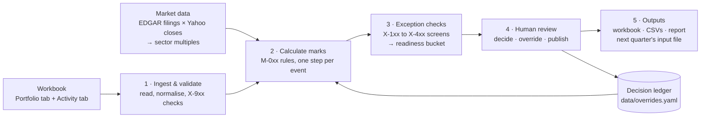

# How the valuation engine works

*A plain-English guide to the system as built, for someone who understands valuation but does not need to read the code. Written against the `v1-refresh` branch, policy `2026Q3-0.2`, engine `0.1.0`. Technical detail is in the appendix.*

## The one-paragraph version

Each quarter you give the engine one Excel workbook — the portfolio as it stood at the last close, and a tab of what happened since. It rolls every mark forward under a fixed set of rules (a priced round re-marks at the new post-money; an exit realizes proceeds; no news carries the prior mark), then screens every position against a fixed set of tests (is the price stale, is revenue shrinking, is cash short, does the implied multiple look wrong). Anything the rules could not settle on their own is put in front of a person with two or three priced ways to resolve it. A person decides, under their name, and the decision is written to a ledger. The booked marks, an audit trail down to the workbook cell, and next quarter's input file come out the other end. The arithmetic is deterministic: the same workbook and the same policy produce the same numbers every time, and a test proves it. AI is not in that loop; it is available at two points, both switched off by default, and neither can produce a number.

## 1. The flow



Two things about the shape. The ledger feeds back into the calculation: a decision recorded this quarter is re-applied on every rerun, so the booked number and the reason behind it travel together. And nothing between stage 1 and stage 3 touches a file, the network or the clock — it is a pure function of the workbook, the policy file, the market data and the ledger, which is what makes the determinism test possible.

## 2. What each stage does

### Stage 1 — Ingest and validate

**Input:** `data/HC_Mock_Portfolio_Data.xlsx` — a Portfolio tab (one row per position: prior mark, ownership, invested, latest round, ARR, growth, runway, sector, stage) and an Activity tab (one row per event: company, event type, date, post-money or deal value, ownership after, HC's cheque, notes).

**What it does:** finds the tabs by name pattern, reads the columns by header (not by position), and tolerates the kind of drift a real workbook has — a typo in an event type, a header renamed, `$28.2M` typed as text, a percentage entered as `5.5` instead of `0.055`. Every correction is recorded as an X-91x finding so you can see what it assumed. Then the integrity checks: a row it cannot read, an event dated outside the quarter, a duplicate, activity on a company already shut down, a prior mark that does not reconcile to last quarter's booked mark.

**Rules used:** X-900 to X-926. Tolerances live under `normalization:` and `tolerances:` in the policy file.

**AI:** none. A row that cannot be read *blocks that position* (X-900) and the prior mark is carried; it never guesses. A row it could read only by correcting it — `5.5` taken as 5.5%, a row dated a week before the window — is applied, and the position carries a finding saying so (X-923) until a person confirms the reading. A row that contradicts the position's own history — a financing on a company already acquired, a round dated after this quarter's shutdown — is recorded, not applied, and blocks.

### Stage 2 — Calculate marks

**Input:** the validated book and activity, the market data, the decision ledger, the policy file.

**What it does:** for each position, applies each of its events in a fixed precedence order, one rule per event type, each rule writing one *step* to the audit chain (rule id, inputs, prior value → new value, a sentence of rationale, and the workbook row it came from). The main rules, in the reviewer's words:

| Event on the Activity tab | Rule | What the mark becomes |
|---|---|---|
| Priced equity round | M-010 | ownership after × post-money. A flat or same-terms extension (M-011) reprices but does **not** reset the staleness clock; a down round or recap (M-012) is priced mechanically and always blocks, with a 25% structure haircut recorded as an alternative |
| Acquisition closed | M-020 | mark to zero, cash to realized, status Acquired. Stock consideration (M-024) instead holds ownership × deal value and blocks |
| Acquisition announced, not closed | M-050 | probability-weighted: 90% × deal value + 10% × standalone (configurable), always blocks for ratification |
| Shutdown / Chapter 11 | M-021 / M-025 | mark to zero (shutdown); unchanged and blocked (Chapter 11 — the recovery estimate is not in the workbook) |
| Secondary sale / purchase | M-030 / M-031 | proceeds realized; the remainder re-marked on the policy's basis; the price is checked against the last round |
| IPO / direct listing | M-040 | measurement-date market cap × ownership, Level 1, lock-up discount per policy (0% today, ASU 2022-03) |
| Convertible note | M-060 | the cap is not a price: equity unchanged, HC's new money carried at cost as a separate leg |
| Term sheet | M-070 | non-binding: mark unchanged, disclosed as a pending item |
| Nothing | M-000 | carry the prior mark |

A position that was listed last quarter and has no event re-marks to its measurement-date market cap (M-041). A stale Level 3 position with a live comps history gets a **calibrated alternative** (M-080: the median of each public comparable's own move since the round month, over the same names, capped at ±35%) written beside the mark, never into it.

**AI:** none. Every number here is arithmetic on workbook cells and policy constants.

### Stage 3 — Exception checks

**What it does:** screens every position and attaches *findings*, each with a severity — BLOCK, REVIEW, MONITOR — and, for anything a person must act on, two or three summary points, a full explanation, and one to three priced resolutions. The screens fall into families:

| Family | The question | Examples (thresholds from the policy) |
|---|---|---|
| Treatment | Did the rule have to make a judgment call? | announced deal (X-101), recap (X-102), secondary off the last-round price by >5% (X-104), HC-funded bridge (X-107), cheque price off the stated post by >10% (X-119), HC's stake rose in a round it did not fund (X-123) |
| Staleness | How old is the price behind this mark? | >24 months MONITOR (X-201), >48 months REVIEW (X-202) |
| Growth | Is revenue going backwards? | ARR contracting MONITOR (X-301), down >15% REVIEW (X-302) |
| Liquidity | Is cash short? | runway <12 months MONITOR (X-303), <6 months REVIEW (X-304) — aged one month for reporting lag |
| Valuation | Does the implied multiple look wrong? | above 2× / below 0.5× the live sector median (X-401 / X-402); MOIC >5× on a stale round (X-404); a stale price with any of these against it → REVIEW (X-405) |
| Notes | Does the free text say something the columns do not? | 75 screened terms — *pay-to-play*, *recap*, *bridge*, *going concern*… (X-105) |
| Related party | Did the price come from an insider? | HC-led (X-117), insider-led with a ≥2× step-up (X-118) |

Then the position is put in one **readiness bucket** — Blocked, Needs Review or Ready — described in section 3.

**AI:** none in the screens. The one optional model integration at this stage is the *recommender*: when switched on, it chooses which of the engine's already-priced resolutions to show first and writes the sentence a reviewer reads. It cannot invent a resolution or a number. The shipped policy sets `recommendation.provider: claude`, so on a run with a key every suggestion is the model's choice among the engine's candidates; without a key it falls back to the rule's own default and is labelled "Policy suggestion".

**Reading the notes.** The columns drive every rule; the free text on a row (Detail, Notes) is where
the situations the columns cannot hold turn up — an escrow, a preference senior to HC, a stake that
"per the cap table" differs from the cell, a figure that supersedes the Portfolio tab, an instruction
to whoever values the position. The engine reads that text twice. A keyword screen (X-105) raises a
fixed vocabulary from the policy. Then the note reader — Claude, when `ANTHROPIC_API_KEY` is set —
classifies each row's text against the case catalogue (`docs/case-catalogue.md`: 29 kinds of thing a
note can say) and reports, quoting the row, what it found. The engine compares that with what the
row's rule took account of and raises the rest for review: X-130 for a kind no rule applied, X-131
when the text states a different value for a column, X-126 when it supersedes the tab, X-132 when a
row could not be read. A situation outside the catalogue is `other`, and `other` always reaches a
person. The reader never sets a number, never lowers a severity, never removes a finding; with it
off (the footer says so) only the keyword screen runs. Readings are cached, so a rerun of the same
workbook is identical and needs no network.

**Where Claude sits, and what it may never do.** Two places, both outside the pure engine and both
advisory. (1) The *note reader* classifies each row's free text against the case catalogue and says,
quoting, what it found and what it means for the mark; the engine turns that into review findings.
(2) The *recommender* picks, for each
card, one of the engine's own priced options as the suggested next step and says why. None of the
three can produce a number, lower a severity, remove a finding or mark a position Ready; every answer
is cached, quoted and labelled with the model that gave it; and each falls back to a deterministic
default (keyword screen, built-in heuristics, policy default) that the footer names when the model is
not reachable. That is the line the assessment draws — "does it know when to escalate to a human" —
and the models are there to make the escalation better explained, never to make it less often.

### Stage 4 — Human review

**What it does:** the review tool (`hc-valuation run`) opens on the **Activity** tab (the review queue), whose first group is every position the Activity tab touched — with the row, the rule that applied it and the mark it produced, Blocked first — followed by the rest of the book that still needs a person. Each card has one primary action that addresses the actual blocker ("Add closing price" on a listing with no quarter-end quote; otherwise the suggested step), and Override as the secondary route. Every route ends in the same confirmation, which will not close without a name and a reason. The decision is appended to `data/overrides.yaml` and the run recomputes.

Publishing is the final gate: `Publish` refuses while any position is Blocked or Needs Review, and can require a second named approver (`publish.require_second_approver`).

**AI:** none in the decision path. A person's name is on every recorded number.

### Stage 5 — Outputs

`hc-valuation build` writes the review workbook (`valuation_Q3_2026.xlsx`: Marks, Exceptions, Audit Trail, Open Items, Alternatives, Fund Rollup, Validation), the same as CSVs, a single-file `report.html` of the review tool, `exec_report.html` for the executive dashboard once a quarter is published, and — withheld only when the workbook itself failed a blocking integrity check (X-9xx) — **next quarter's input workbook** with this quarter's booked marks as its Prior Mark column, plus a sidecar carrying the open items forward. The round trip is tested: the emitted file re-ingests with zero blocking issues.

## 3. What decides the bucket

Every finding has a severity. The position's **readiness** is one state, decided by what is *unresolved* after any recorded decision:

| Readiness | Triggered when | What it means for the reviewer |
|---|---|---|
| **Blocked** | An input the mark needs is missing: a listed position with no measurement-date price (the mark is a *provisional* stand-in), stock consideration with no listing details (X-112), Chapter 11 (X-116), a refused or contradictory workbook row (X-900), a company created from activity with no Portfolio row (X-918), an event type no rule recognises (M-999 — the treatment is missing until a rule for it is written into the policy file) | There is no supported number yet. The primary action supplies the input; an override must acknowledge, in writing, that it is stepping past the gap — and an override that names no finding never clears a Blocked one |
| **Needs Review** | Any other BLOCK- or REVIEW-severity finding is unresolved — a recap, an announced deal, a stale round with a screen against it, short runway, shrinking revenue | A proposal exists and is defensible; a person must ratify it, pick another priced option, or override |
| **Ready** | Nothing unresolved above MONITOR | Checks complete; the proposal can be approved as it stands |

A decision resolves the findings it names (`rule_ids_addressed`), and only those. A provisional mark stays Blocked until a decision names its rule — the committee accepting the stand-in knowingly. A BLOCK-severity *finding* does not by itself mean a Blocked *position*: Gryphonel's announced deal is BLOCK severity, but nothing is missing, so it is Needs Review.

**Noted** findings are not a bucket. A position can carry them — a 24-month-old round, a high multiple, an insider-led round — and still be Ready. They read under "Also noted, nothing to decide" on the card. A position itself carries one word only: Blocked, Needs Review or Ready.

Two more states are kept separate from readiness. **Approval** is Not approved → Decision recorded → Approved and published; nothing is "booked" until the quarter is published. And the older **disposition** vocabulary (BLOCK / REVIEW / MONITOR / CLEAR) still exists underneath as the maximum severity of a position's findings, with one escalation: two REVIEW findings from *different families* compound to BLOCK. It drives the executive dashboard's counts and the Companies table; the cards speak readiness.

## 4. Three worked examples

All three are real positions in the current run.

### A straightforward financing — Dovelane Systems

*Fund II · Fintech · Series B.* Prior mark $4.10M at 7.6% ownership. The Activity tab has one row: a priced Series B on 6 July 2026 at $103.8M post-money, ownership after 5.5%, no HC cheque.

**Calculation.** M-010: 5.5% × $103.8M = **$5.71M** (+$1.61M, +39%). One step, one sentence: *"An arm's-length transaction in the subject security is the strongest Level 3 input available."* The staleness clock resets to July 2026.

**Checks.** Two MONITOR findings, nothing to decide. X-103: HC did not follow its pro rata, so ownership fell 7.6% → 5.5% (−27.6%) — a reserves question, not a valuation one. X-401: at $2.5M ARR the mark implies 42× revenue against a 2.8× Fintech median — a cross-check, not a valuation, and the round price stands.

**Readiness: Ready.** Approval pending. It appears at the top of the Activity tab, in the new-activity group, with the row and the arithmetic. Nobody has to do anything except read it.

### No activity, but a concerning metric — Umberly

*Fund II · AI/ML · Series B.* Prior mark $24.1M at 8.6%, last priced October 2023 at $279.8M post. No rows on the Activity tab.

**Calculation.** M-000: carry $24.1M. Then M-080 runs, because the round is 35.7 months old and the AI/ML basket has a live history: the five AI/ML comparables' own multiples moved ×0.45, ×3.34, ×0.58, ×4.50 and ×1.38 since the round month, a median of ×1.385 (+38.5%), capped by policy at +35%, so a **calibrated alternative of $24.10M × 1.35 = $32.54M** is recorded beside the mark. The mark itself does not move.

**Checks.** X-201 MONITOR: the round is older than 24 months. X-304 REVIEW: **3.1 months of cash** — $5.6M on hand against $1.36M a month, aged one month for the reporting lag. The engine's summary: *the company must raise before the next close; the round that saves it may be priced below this mark.*

**Readiness: Needs Review.** The card offers two priced options — *Keep the mark as proposed* ($24.1M, the policy default: cash on hand does not change the last-round price) and *Mark down to invested cost pending the raise* ($10.0M: cost is a defensible floor when a company must raise to survive). The comps alternative says the sector has re-rated upward; the runway says the company may not be around to enjoy it. That tension is exactly what a person is for. Whichever they choose is recorded under their name with a reason, and X-304 is marked resolved by that decision.

### A complex event requiring judgment — Gryphonel

*Fund I · AI/ML · Series B.* Prior mark $3.5M at 3.6%, last priced September 2020. The Activity tab has a definitive agreement: an all-cash acquisition at $133M, signed 8 September 2026, *expected to close in Q4 subject to regulatory approval, no cash received.*

**Calculation.** M-050, probability-weighted per policy: 0.90 × $4.79M (closes: 3.6% × $133M) + 0.10 × $3.50M (breaks: standalone at the last round) = **$4.66M**. The step records all four numbers — full value, standalone, weighted, hold-prior — so the reader sees the arithmetic, not just the answer.

**Checks.** X-101 BLOCK severity: *the rule had to choose.* Buyer signed, deal not closed, approval outstanding. X-201 MONITOR: the standalone fallback rests on a six-year-old price. An open item is created and will escalate (E-07) if the deal is still unclosed after two quarters.

**Readiness: Needs Review** — the finding is BLOCK-severity, but nothing is missing; a judgment is. Three priced options: ratify the weighted $4.66M (policy default: *reflects a signed agreement with a real chance of not closing*), book the full $4.79M (*right if the closing conditions are formalities*), or hold $3.50M until it closes (*right if approval is uncertain or the buyer is stretched*). The reviewer's job is to know which of those three sentences is true about this buyer.

## 5. Operating manual

### Run a quarter

```
cd ~/Documents/GitHub/Val_engine
export HC_SEC_CONTACT=you@human.capital          # SEC asks for a contact on EDGAR requests
python3.12 -m hc_valuation.cli validate            # ingest only; exit 1 if anything blocks
python3.12 -m hc_valuation.cli market --provider live --refresh   # once per quarter: refetch comps
python3.12 -m hc_valuation.cli run                 # serve the review tool at 127.0.0.1:8765
```

Work the Activity tab top to bottom: the new-activity group first, then the rest. When nothing is Blocked or Needs Review, **Publish** from the header (name required; a second name if the policy asks). Then:

```
python3.12 -m hc_valuation.cli build               # workbook, CSVs, report, next quarter's input file → dist/
python3.12 -m hc_valuation.cli next-policy         # rules/2026Q4.yaml, inheriting everything
```

Commit `data/overrides.yaml`, `data/published/`, `data/market_cache/` and `dist/portfolio_Q4_2026.xlsx` — the booked number always travels with the decision behind it.

### Investigate a flag

On the card: the headline says why the position stopped; *Why flagged* gives the two or three facts; *Evidence* opens the full explanation, the rule's "why this is a flag / why this severity" from the catalogue, and every input the rule recorded. *Evidence & history* folds out the rule codes with their names, the stand-in sentence if the mark is provisional, the decision on record, and last quarter's flags. *Calculation* opens the audit chain — every step, prior → new, and the cell it read.

In the exports: `exceptions.csv` has one row per finding with the action and summary; `audit_trail.csv` has one row per step with the rationale and an **Input Cells** column like `'Q3 2026 Activity'!E18`.

### Approve or override

Every route ends in the same confirmation — name and reason required, nothing written until Confirm:

- **Accept the suggested step** (the primary button, or *Apply* on a non-headline finding) — the reason is prefilled from the rule's own reasoning and is editable.
- **Accept proposed mark** — from the Override control; records the engine's proposal as considered and resolved.
- **Enter a mark** — from the Override control; the reason starts empty, because you are the only one who knows why.
- **Add closing price** — on a listing with no quarter-end quote; market cap or price × shares, a required source, the mark derived from HC's stake, the evidence attached to the ledger record.

On a Blocked position, any override that does not supply the missing input must tick an acknowledgement, and the ledger reason is prefixed `[input still missing]`. Stepping past evidence is allowed; doing it silently is not.

To change a recorded decision: *Change decision* on the card records a new one that supersedes it. The ledger is append-only; nothing is edited in place.

### Trace a final mark back to its source

Marks sheet → the company's **Portfolio Row** → Audit Trail rows for that company, in sequence → each row's **Input Cells** → the workbook. The E-01 row on the trail is the committee decision: who, when, what was booked against what was proposed, how the number was chosen (*engine option*, *proposed mark accepted*, *mark entered by the approver*, *closing price supplied*), and the reason. The run's `manifest.json` carries the `run_id`, a hash of the workbook, the policy content, the engine version, the ledger and the market source — if any of those changed, the id changed.

## 6. What is real, what is mocked, what is planned

**Implemented and live.** Everything in stages 1–5 above. The comps feed is real: SEC EDGAR filings and Yahoo closes, cached under `data/market_cache/`, 54 public names across 12 five-name baskets (a few names sit in two), 55 to 96 months of history per sector. The decision ledger, the publish gate, the audit trail, the next-quarter round trip, the review tool and the executive dashboard all work end to end. 1,314 tests, including a golden fixture that pins all 100 positions, a determinism test, and a 223-test stress suite (`tests/stress/`) covering threshold boundaries, overlapping and malformed activity, the approval controls, and no-activity positions.

**Mocked, and labelled as such in the UI.**

- *Quotes for listed positions.* There is no live price feed for individual stocks. Drayvenn, which listed in September, is seeded to its IPO print and marked **provisional**; the card says "Missing quarter-end share price" and the primary action asks you to supply it. The tickers in the workbook are synthetic, so no feed could price them anyway.
- *Vendor signals.* The Foresight (metrics) and AlphaSense (news) panels read from fixture stubs. The connector slots exist; nothing live is wired.
- *PitchBook comps.* `--provider pitchbook` is a registered name that returns the fixture with a "not configured" note.
- *The measurement date.* The workbook's quarter ends 30 September 2026; the market cache was fetched on 8 September. The "September" close is the last one on file at retrieval, not a quarter-end print, and the Market tab says so in its first line.

**Optional, and inert without a key.** The AI recommender (`recommendation.provider: claude`) and the note reader (`note_reader.provider: claude`). Both need `ANTHROPIC_API_KEY`; both cache every answer so reruns are offline and deterministic; both fall back to the policy default and say so.

**Planned, not built.** A live quote feed; deeper comps baskets (five names is thin — the ±35% M-080 cap binds on 23 of 42 indications for that reason); a CSV export that preserves the Companies view's current filter; the Companies detail panel and the executive dashboard still use the older "booked" vocabulary rather than readiness.

## 7. Where to change things

| To change… | Edit | Notes |
|---|---|---|
| Any threshold — staleness months, runway months, growth floor, multiple bounds, MOIC, close probability, lock-up discount, structure haircut, spread tolerances | `rules/2026Q3.yaml` | Every number the engine uses is here; there are no numeric literals in the engine. The header comment says which section holds what. Changing one changes the `run_id` |
| Which resolution is shown first, and whether a model chooses | `recommendation:` block | `policy` or `claude` |
| Whether publishing needs a second name | `publish.require_second_approver` | |
| The plain-English name, family and "why" of each rule, and whether the brief asked for it | `rules/rationale.yaml` | Feeds the card headlines, the Rules tab and the Evidence dialog |
| The public comparables per sector | `rules/comps_baskets.yaml` | Then `market --provider live --refresh` |
| Screened note-text terms and their exemptions | `note_screen:` block | |
| How much workbook drift to tolerate | `normalization:` and `tolerances:` blocks | |
| Next quarter's policy | `hc-valuation next-policy` | Inherits everything; edit only what changed |
| A rule for an event type the engine does not handle | `custom_rules:` | A declarative formula in the policy file, approved and dated by a person, never code. The whitelist it is parsed against is the `declarative:` block |
| Pre-engine mark history for the chart | `data/mark_history.yaml` | Optional; tagged "backfill"; never read by the engine |

---

## Appendix

### A. The audit chain in detail

Each position's `steps` is an ordered list. A step has: `rule_id` and `rule_version`; `sequence`; `inputs` (the named values the rule read, e.g. `post_money`, `ownership_after`); `prior_value` and `new_value`; `rationale` (one or two sentences); and `evidence` (the Activity sheet and row, event type and date) when an event drove it. Carry (M-000), refusals (X-900) and the committee override (E-01) are steps too, so the chain is complete: prior mark to booked mark with nothing between them unexplained.

**Input Cells** are derived, not hand-written: each input name maps to a workbook column through the schema, and the exporter emits `'<sheet>'!<column letter><row>` from the row the step recorded.

**`run_id`** = first 12 hex characters of `sha256(input_sha256 | policy_version | sha256(policy content) | engine_version | sha256(ledger + carried open items + staleness anchors) | market_data_source)`. Two runs with the same id have the same inputs in every sense that matters.

**Determinism test** (`tests/test_determinism.py`): two full runs serialise byte-identical; a JSON round trip is stable; and changing one threshold (`runway.review_below_mo` 6 → 12) must fail the golden fixture with a readable diff.

### B. Readiness and disposition, exactly

```
unresolved(flags, override):
  no override                      → every flag
  override naming no rule ids      → BLOCK-severity flags cleared, except missing-input ones; REVIEW flags stay
  override naming rule ids         → exactly those ids cleared; MONITOR never counts

readiness_of(flags, override, provisional_rule):
  Blocked      if provisional_rule set and not in override.rule_ids_addressed
  Blocked      if any unresolved flag in {X-900, X-112, X-113, X-116, X-918, M-999}
  Needs Review if any unresolved flag remains
  Ready        otherwise

monitor = any finding of MONITOR severity            (a tag, independent of the above)

action_of: last rule to touch the mark decides —
  Carry (M-000, M-041) · New investment (M-014) · Partial exit (M-030) ·
  Full exit (M-020, M-024) · Write-off (M-021, M-025) · Revalue (anything else)

approval_of: Approved and published if the quarter is published;
             Decision recorded if an override exists; else Not approved

disposition (the older, finding-level vocabulary):
  BLOCK   any unaddressed BLOCK finding, or ≥ 2 REVIEW families and no override
  CLEAR   terminal position with nothing above MONITOR
  REVIEW  any REVIEW family
  MONITOR any MONITOR finding, or an override on file
  CLEAR   otherwise
```

A **provisional** mark is one whose step recorded a `price_source` beginning `stub:` or containing `seeded` — today, only a listed holding with no measurement-date quote.

### C. Files and ledgers

| Path | What it is |
|---|---|
| `data/HC_Mock_Portfolio_Data.xlsx` | The input workbook |
| `rules/2026Q3.yaml` · `rules/rationale.yaml` · `rules/comps_baskets.yaml` | Policy, rule catalogue, comps baskets |
| `data/overrides.yaml` | E-01 committee decisions; append-only; versioned |
| `data/published/2026Q3.json`, `latest.json`, `history/` | The released snapshot the executive dashboard reads |
| `data/precedent.yaml` | How often each treatment has been decided the same way |
| `data/market_cache/2026-09-30/` | EDGAR extracts, raw facts, closes, split events, `meta.json` |
| `data/recommendations/` | Cached model answers, when the recommender is on |
| `dist/valuation_Q3_2026.xlsx` | Marks · Exceptions · Audit Trail · Open Items · Alternatives · Fund Rollup · Validation |
| `dist/*.csv` | The same tables, plus `mark_history.csv` |
| `dist/report.html`, `dist/exec_report.html` | Single-file review tool and executive dashboard |
| `dist/run.json`, `dist/manifest.json` | The full run and its identity |
| `dist/portfolio_Q4_2026.xlsx`, `dist/open_items_carry.yaml` | Next quarter's input and its sidecar |

### D. The rule inventory, compact

**Marking (M-0xx).** M-000 carry · M-010 priced round (→ M-011 flat, M-012 recap) · M-013 ownership adjustment · M-014 new investment at cost · M-020 acquisition closed (→ M-024 stock consideration) · M-021 shutdown · M-022 distribution · M-025 Chapter 11 · M-030 secondary sale · M-031 secondary purchase · M-040 IPO/listing · M-041 listed carry · M-050 acquisition announced · M-051 deal terminated · M-060 convertible note · M-061 note repaid · M-070 term sheet · M-080 comps calibration (alternative only) · M-999 unrecognised event (blocks).

**Exceptions.** Treatment X-101…X-123 and M-999; staleness X-201/202; growth X-301/302; liquidity X-303/304; valuation X-401…X-405; notes X-105; related party X-117/118; decision drift E-01; aged open item E-07; data X-900…X-923. Ten of the 54 catalogue entries are marked `source: brief` — the exceptions the assessment named; the rest are the fund's own calls, each with a two-line defence in `rules/rationale.yaml`.

### E. Commands

`validate` · `run` (`--watch` recomputes on file change) · `build` · `export` · `publish` (`--proposed` bypasses the gate for a draft) · `market` · `history` · `recommend` · `rules` · `next-policy` · `version`. Defaults: workbook `data/HC_Mock_Portfolio_Data.xlsx`, policy `rules/2026Q3.yaml`, output `dist/`, port 8765. Environment: `HC_SEC_CONTACT` (EDGAR), `ANTHROPIC_API_KEY` (optional), `HC_MARKET_PROVIDER`, `HC_HOST`/`HC_PORT`.

### F. Glossary

**Mark** — the fair value of HC's stake in one company, $M. **Proposed** — the engine's mark before any decision. **Provisional** — a proposed mark resting on a stand-in input. **Recorded** — a decision exists but the quarter is not published. **Booked** — published. **Level 1 / 3** — ASC 820 fair-value hierarchy: quoted price vs unobservable inputs. **Post-money** — company value after a round; ownership × post-money is the mark. **TTM** — trailing twelve months. **EV/Revenue** — enterprise value ÷ TTM revenue; the comps multiple. **PWERM** — probability-weighted expected return: the announced-deal treatment. **ASU 2022-03** — a contractual lock-up is not a characteristic of the security, so no discount. **E-01** — a committee override on the ledger. **E-07** — an open item carried past its ageing limit. **M-999** — an event type the engine does not know. **Staleness anchor** — the date of the last real price discovery; a flat extension does not move it.
